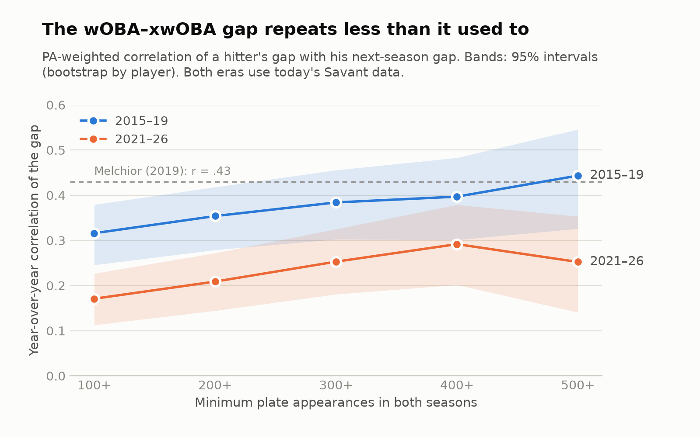

# How Much Should a Front Office Trust a Hitter's xwOBA Gap?

When a hitter's actual production (wOBA) runs well ahead of or behind his Statcast expected
production (xwOBA), the usual read is "luck, it'll regress." But part of that gap is
repeatable skill that xwOBA doesn't see. This project measures **how much of the gap to
believe, given how many batted balls we've seen and what kind of hitter he is**, and turns
that into a discount a front office can apply when evaluating trade and free-agent targets.

> **Status: in progress (Oct 2026).** Steps 0–1 are done; steps 2–5 are a plan. Nothing is a
> finding until it's marked done in the plan below.

## Findings so far

**The gap repeats less than the published research says.** Among hitters with 300+ PA in
back-to-back seasons, the year-over-year correlation of the wOBA–xwOBA gap was **.38 in
2015–19 and .25 in 2021–26** (difference −.13, 95% CI −.23 to −.02). About a quarter of a
full-season gap now carries into the next season. The method reproduces the published
estimate exactly on its original seasons (r = .42 on the same 322 hitter-pairs as
Melchior's .43), the shift ban isn't the cause, and a fading link between the gap and
sprint speed explains about a quarter of the drop. Full write-up:
[`docs/step1.md`](docs/step1.md).

<picture>
  <source media="(prefers-color-scheme: dark)" srcset="docs/figures/step1_persistence_dark.png">
  
</picture>

## Why this question

How much of the gap regresses is usually stated as a rule of thumb rather than measured.
The published evidence: when the same hitters are tracked across consecutive seasons, the
gap's year-over-year R² is about .17 (r ≈ .43 in Melchior's 2015–2019 sample), so well under
half of it carries forward
([Edwards, FanGraphs 2017](https://blogs.fangraphs.com/how-to-beat-statcasts-hitting-metric);
[Melchior, RotoGraphs 2019](https://fantasy.fangraphs.com/are-there-chronic-woba-over-and-under-performers)).

Prior work has also identified where the repeatable part comes from:
- **Sprint speed**, which drove much of the gap
  ([Chamberlain 2018](https://fantasy.fangraphs.com/how-sprint-speed-relates-to-woba-xwoba))
  and which xwOBA has partly accounted for since 2019, on topped and weakly hit balls
  ([MLB glossary](https://www.mlb.com/glossary/statcast/expected-woba)).
- **Pulled, hard-hit fly balls**, a sticky hitter trait that xwOBA doesn't capture because
  it doesn't use spray angle
  ([Clemens, FanGraphs 2023](https://blogs.fangraphs.com/an-meandering-examination-of-fly-ball-pull-rate-featuring-stars-of-the-game-and-also-isaac-paredes/);
  [Salorio 2024](https://adamsalorio.substack.com/p/introducing-opt_95-identifying-hitters)).
  In 2019 Tom Tango found xwOBA showed no bias by a hitter's overall pull tendency and left
  spray angle for future work
  ([tangotiger.com](https://tangotiger.com/index.php/site/comments/of-spray-angles-fip-and-xwoba-part-2));
  the later work points to the hard-hit, pulled fly ball specifically.
- **Park**, which xwOBA removes by design.

What this project adds:
1. **A replication on 2021–2026 data.** The persistence estimates above use 2015–2019 data,
   mostly from before xwOBA added sprint speed (2019) and all from before the 2023 shift ban.
2. **Reliability as a function of sample size.** Stabilization work exists for many stats,
   but I haven't found a published curve for the gap on post-2022 data: how much of a
   150-batted-ball gap vs. a 450-batted-ball gap should carry forward?
3. **An out-of-sample test.** Does adjusting for pulled fly balls and park predict *next
   season's* wOBA better than xwOBA alone?

## Plan

| Step | Question | Status |
|---|---|---|
| 0 | Build a reproducible, validated player-season dataset (2021–2026) | ✅ Done |
| 1 | How strongly does the gap persist year over year in 2021–2026, and does it match the published r ≈ .43? | ✅ [Done](docs/step1.md) |
| 2 | How does gap reliability change with sample size? (within-season split-half, shrinkage table) | ⬜ |
| 3 | Which hitter traits (pulled-air rate, park, speed, handedness) explain the persistent part? | ⬜ |
| 4 | Does an adjusted expectation beat plain xwOBA at predicting next-season wOBA? | ⬜ |
| 5 | Front-office memo: 2026 trade/free-agent targets whose results misstate their underlying quality | ⬜ |

## Data

All public, downloaded by `src/fetch_data.py` and cached locally in `data/raw/`. The raw
files are **not committed**: MLB Advanced Media's terms limit this data to personal,
non-commercial use, so the repo ships the code to rebuild it rather than the data itself.

| Source | Fields | Notes |
|---|---|---|
| [Baseball Savant](https://baseballsavant.mlb.com) custom leaderboard | PA, wOBA, xwOBA, K%, BB%, barrel %, hard-hit %, spray %, batted-ball type %, sprint speed, bat speed | Min 100 PA, 2021–2026. Bat speed: full seasons from 2024 |
| Savant batted-ball leaderboard | Pulled / straightaway / opposite-field air-ball rates | Min 50 batted balls |
| Savant expected-stats leaderboard | PA, wOBA, xwOBA | Independent endpoint, used only to cross-check |
| [MLB Stats API](https://statsapi.mlb.com) | PA by team, team and venue IDs, batting hand | Joined on MLBAM player ID |
| Savant, 2015–2019 | PA, AB, pitches, wOBA, xwOBA, sprint speed | Era comparison and replication of published estimates (step 1) |

**Dataset:** 2,774 player-seasons and 1,780 consecutive-season pairs (2021–2026), plus
2,216 player-seasons and 1,365 pairs (2015–2019). Column definitions:
[`docs/data_dictionary.md`](docs/data_dictionary.md).

### Validation

Every build runs 22 SQL checks ([`sql/02_validation.sql`](sql/02_validation.sql)):
uniqueness at every join stage, all six seasons present, missing values in every column, plausible ranges, PA
reconciliation between Savant and the MLB Stats API, and a cross-check of every
player-season's PA, wOBA, and xwOBA against a second Savant endpoint (2,774 of 2,774
match; 2,216 of 2,216 for 2015–2019). Latest results: [`docs/validation_report.md`](docs/validation_report.md).

The PA reconciliation check caught a real bug: the MLB Stats API's team endpoint leaves out
players who left a team midseason, which undercounted PA for 31 hitters and could assign
them the wrong home park. Details and other data decisions:
[`docs/data_notes.md`](docs/data_notes.md).

## Reproduce

```bash
pip install -r requirements.txt
python src/fetch_data.py   # download raw data (~2 min; skips cached files, --force to refresh)
python src/build_db.py     # build data/statcast.duckdb, run checks (exits non-zero on a FAIL)
pytest                     # same checks as a test suite
python src/step1_persistence.py   # step 1 analysis -> results/step1_*.csv
python src/step1_figures.py       # step 1 charts -> docs/figures/
```

## Repository layout

```
src/fetch_data.py         download Savant + MLB Stats API data to data/raw/
src/build_db.py           build the DuckDB database, run checks, write the report
src/step1_*.py            step 1 analysis and figures
sql/01_build_tables.sql   staging tables, player_season, season_pairs, 2015-19 history
sql/02_validation.sql     data-quality checks
sql/03_step1_pairs.sql    step 1 analysis table (centered and speed-adjusted gaps)
tests/                    pytest wrapper around the validation checks
results/                  step outputs (CSV)
docs/                     step write-ups, figures, data dictionary, validation report, data notes
```

## About

Built by Jack Eisinger ([LinkedIn](https://www.linkedin.com/in/jack-eisinger)). I played
baseball through high school and am a lifelong Mets fan. Before this, I spent a year at
Epic validating clinical data with SQL and translating physicians' questions into testable
requirements. The reliability framing in step 2 comes from my psychology research
background (survey design, Cronbach's alpha).

Code was written with [Claude Code](https://claude.com/claude-code) under my direction. I
chose the question, reviewed every data decision, and can walk through any line.
