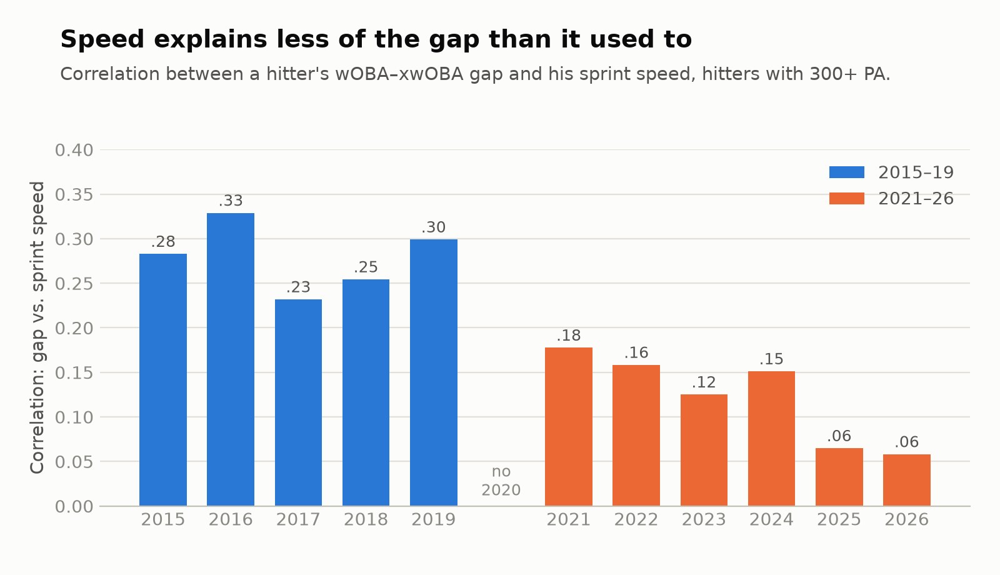

# Step 1: Does the gap still repeat?

**Question.** When a hitter's wOBA beats or trails his xwOBA, how much of that gap shows
up again the next season, and does the published estimate (r ≈ .43) still hold?

**Answer.** Less than it used to. Among hitters with 300+ PA in back-to-back seasons, the
gap's year-over-year correlation was **.38 in 2015–19 and .25 in 2021–26**. In practical
terms, about **a quarter** of a full-season gap now carries into the next season, down
from about 38%. The shift ban doesn't explain the drop; a fading link between the gap and
sprint speed explains about a quarter of it.

<picture>
  <source media="(prefers-color-scheme: dark)" srcset="figures/step1_persistence_dark.png">
  
</picture>

## Data and method

- **Two eras, one source.** 2021–2026 from the main dataset, and 2015–2019 pulled from
  Savant on the same day (October 8, 2026), so both eras use xwOBA as Savant calculates it
  today. 2020 is excluded.
- **Pairs.** A hitter's season and his next season, both with at least the PA threshold.
  2015–19: 1,365 pairs at 100+ PA. 2021–26: 1,780.
- **Centering.** Each gap is measured relative to that season's league average, so a
  league-wide shift isn't counted as player persistence.
- **Statistic.** Correlation between season-1 and season-2 gaps, weighted by the harmonic
  mean of the two seasons' PA (a pair is only as informative as its smaller season). The
  weighted regression slope is reported too: the share of a season-1 gap that reappears.
- **Uncertainty.** 95% intervals from 2,000 bootstrap resamples **of players**, keeping all
  of a player's pairs together, because most hitters appear in several pairs.
- Code: [`sql/03_step1_pairs.sql`](../sql/03_step1_pairs.sql),
  [`src/step1_persistence.py`](../src/step1_persistence.py). Every number below is in
  [`results/`](../results).

## Findings

### 1. The published estimate replicates on 2015–19 data

Using each study's own sample rule and statistic (plain Pearson r on uncentered gaps):

| Study | Sample rule | Published | This data |
|---|---|---|---|
| Melchior (2019) | 2,000+ pitches in back-to-back seasons, 2015–19 | r = .43, 322 hitters | **r = .42** (95% CI .30–.53), 322 pairs |
| Edwards (2017) | 400+ AB in both 2015 and 2016 | R² = .17 (r ≈ .41) | r = .33 (95% CI .17–.48), R² = .11, 123 pairs |

Melchior's sample rule produces the same sample size and essentially the same
correlation. Edwards' estimate falls inside this data's interval; his 2017 analysis used
an earlier version of xwOBA. The pipeline reproduces the published work, so the change
below isn't an artifact of the method.

### 2. In 2021–26 the gap repeats about a third less

| Min PA, both seasons | 2015–19 r | 2021–26 r | Difference (95% CI) |
|---|---|---|---|
| 300+ | .38 (.30–.46) | .25 (.18–.32) | −.13 (−.23 to −.02) |
| 400+ | .40 (.30–.48) | .29 (.20–.38) | −.11 (−.23 to +.03) |
| 500+ | .44 (.33–.55) | .25 (.14–.35) | −.19 (−.34 to −.04) |

The difference intervals come from bootstrapping both eras together (some hitters play
in both). At 400+ PA the interval includes zero; at 300+ and 500+ it doesn't. Every
2021–26 season pair (.22–.31) sits below every 2015–19 pair (.33–.46) at 300+ PA
([`step1_by_season_pair.csv`](../results/step1_by_season_pair.csv)).

The weighted slope at 300+ PA is **.25 (2021–26)** vs. **.38 (2015–19)**: a hitter who
beat his xwOBA by .030 would be expected to beat it by about .008 the next season today,
compared with about .011 before.

### 3. The shift ban isn't the cause

The drop was already there before the 2023 ban (300+ PA):

| Pairs | r (95% CI) |
|---|---|
| Before the ban (2021–22) | .24 (.07–.40) |
| Spanning the ban (2022–23) | .24 (.10–.37) |
| After the ban (2023–24 to 2025–26) | .26 (.18–.35) |

### 4. Speed explains part of the drop

<picture>
  <source media="(prefers-color-scheme: dark)" srcset="figures/step1_speed_dark.png">
  
</picture>

Faster hitters have tended to beat their xwOBA, and speed is a stable trait, so speed is
one reason a gap repeats. That link has faded: the correlation between the gap and sprint
speed was .23–.33 every season in 2015–19 and has fallen to .06 in 2025 and 2026. There's
no break between 2018 and 2019, the year xwOBA began using sprint speed, which suggests
the earlier seasons are calculated the same way as the later ones.

Removing each season's speed-related component from the gap (a per-season regression of
gap on sprint speed):

| | 2015–19 r | 2021–26 r | Difference (95% CI) |
|---|---|---|---|
| Gap | .38 | .25 | −.13 (−.23 to −.02) |
| Gap with speed component removed | .34 | .24 | −.09 (−.19 to +.01) |

Speed accounts for roughly a quarter of the drop. What's left is no longer clearly
different from zero, but it's most of the original difference, so speed is not the whole
story.

## What this means for a front office

- **Discount a full-season gap by about three-quarters.** For a regular (300+ PA both
  years), expect about 25% of this year's wOBA–xwOBA gap to show up next year. Rules of
  thumb built on older data overstate how much a gap carries.
- **Speed is a weaker reason to trust a gap than it used to be.**
- **This is for full seasons of regulars.** How much to trust a gap after 150 or 250 PA is
  step 2.

## Limitations

- **Survivorship.** Pairs require 100–500+ PA in both seasons. Hitters who lose playing
  time after a bad season drop out, which can bias persistence in either direction.
- **One data snapshot.** Savant can revise expected stats; results reflect data downloaded
  October 8, 2026. The 2015–19 comparison assumes Savant's current historical values are
  consistent with its current method; the lack of a 2018–19 break in the speed link
  supports that, but doesn't prove it.
- **The remaining drop is unexplained.** Candidates for step 3 include pulled fly balls,
  park changes, and defensive positioning. These are hypotheses, not findings.
