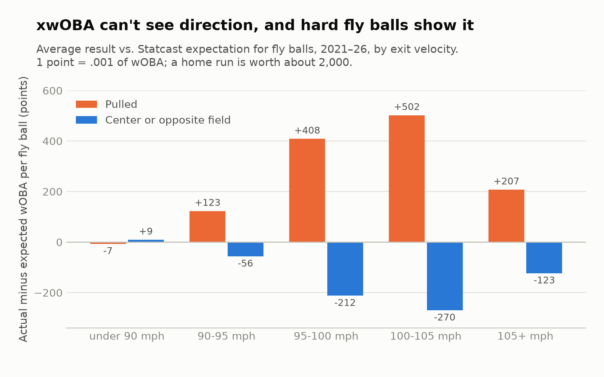
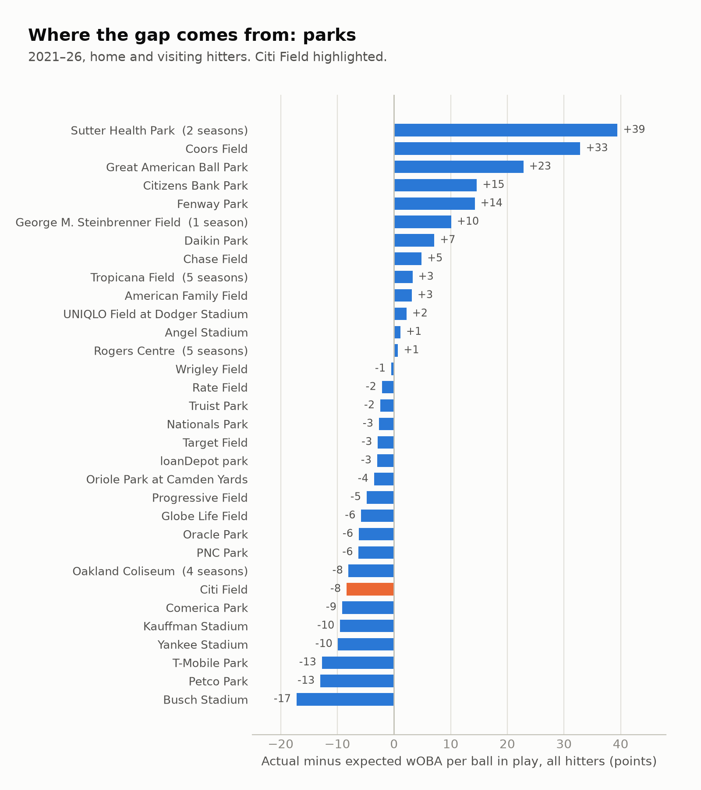

# Step 3: What explains the part of the gap that repeats?

**Answer.** Mostly pulled power, with smaller contributions from speed and park. xwOBA ignores the direction of a
batted ball, and a pulled fly ball at 100–105 mph produces **+502 points** of wOBA more than
xwOBA expects, while the same ball hit to center or the opposite field produces **−270**.
Hitters who pull their hard fly balls beat their xwOBA year after year. But once step 2's
discount is applied, adding these traits doesn't measurably improve next-season forecasts:
the discounted gap already carries most of what they know.

<picture>
  <source media="(prefers-color-scheme: dark)" srcset="figures/step3_pulled_dark.png">
  
</picture>

## Data and method

- **737,666 balls in play** with hit coordinates, 2021–2026 (step 2's data).
- **Spray angle** from Statcast hit coordinates; a ball is **pulled** if it's more than 15°
  toward the batter's pull side. **Pulled hard fly-ball share** = pulled fly balls at
  95–105 mph divided by all balls at 95–105 mph (after
  [Salorio 2024](https://adamsalorio.substack.com/p/introducing-opt_95-identifying-hitters)).
- **Park effect** = average residual (actual minus expected wOBA) of **every** hitter, home
  and visiting, in a park, relative to the league that season. Parks are matched by MLB
  venue ID, so the Rays' 2025 season at Steinbrenner Field and the Athletics' move to
  Sacramento are separate parks. A hitter's **park exposure** averages the effects of the
  parks where his balls in play actually happened.
- **No look-ahead.** For forecasts, park effects use only seasons up to the one being
  forecast from. A first version leaked the target season into park effects; it was
  caught and fixed before the results were written up.
- **Models** are PA-weighted regressions on standardized traits; 95% intervals come from
  2,000 bootstrap resamples of players. Code: [`sql/05_step3_traits.sql`](../sql/05_step3_traits.sql),
  [`src/step3_traits.py`](../src/step3_traits.py).

## Findings

### 1. Direction is xwOBA's biggest blind spot

Average actual minus expected wOBA per ball in play (points; 1 point = .001):

| | Pulled | Center | Opposite |
|---|---:|---:|---:|
| Fly balls | **+242** | −180 | −9 |
| Line drives | +39 | −68 | +25 |
| Ground balls | −40 | +19 | **+102** |

A pulled fly ball goes out over the shortest fences; a fly ball to center dies in the
deepest part of the park. xwOBA averages the two, so it under-credits one and over-credits
the other. On the ground it reverses: pulled grounders go into the teeth of the defense, and
opposite-field grounders find holes. The gap is worth hundreds of points per ball for hard
fly balls, the most valuable contact in baseball (chart above).

### 2. Parks matter, and they're stable

<picture>
  <source media="(prefers-color-scheme: dark)" srcset="figures/step3_parks_dark.png">
  
</picture>

Coors Field (+33 per ball in play), Great American Ball Park (+23), Citizens Bank Park
(+15), and Fenway Park (+14) inflate actual results over xwOBA; Busch Stadium (−17), Petco
Park (−13), and T-Mobile Park (−13) suppress them. **Citi Field is −8**, so Mets hitters'
gaps run slightly low at home. A park's effect in one season correlates **.69** with its
effect in its other seasons. Sutter Health Park, the Athletics' temporary home, shows the
largest effect (+39) on two seasons of data.

### 3. Same season: traits explain about 12% of a hitter's gap

Change in a season's gap per one standard deviation of each trait (2,774 player-seasons):

| Trait | Points per SD (95% CI) |
|---|---|
| Pulled hard fly-ball share | **+7.7** (6.6 to 8.8) |
| Ground-ball rate | +3.8 (2.8 to 4.7) |
| Park exposure | +3.5 (2.7 to 4.2) |
| Sprint speed | +2.6 (1.8 to 3.5) |
| Bats left-handed | −0.5 (−1.3 to +0.3) |

Together they explain 12% of the variation in a season's gap (R² = .12). The other 88% is
mostly the noise step 2 measured.

### 4. Next season: the traits persist, but the discounted gap already knows them

Predicting next season's gap from this season's discounted gap plus traits (1,780 pairs):

| Term | Estimate (95% CI) |
|---|---|
| Discounted gap (step 2) | 0.79 (0.48 to 1.06) |
| Pulled hard fly-ball share, per SD | +2.4 points (1.1 to 3.7) |
| Sprint speed, per SD | +1.4 points (0.5 to 2.3) |
| Park exposure, per SD | +1.0 points (0.1 to 2.1) |
| Ground-ball rate, per SD | +1.2 points (−0.02 to 2.3) |
| Bats left-handed | −0.5 points (−1.4 to +0.5) |

Pulled power, speed, and park each predict next season's gap beyond the discounted gap.
But in an honest test (forecasting 2023→24, 2024→25, and 2025→26 using only earlier
seasons; 1,073 pairs), the gains are too small to separate from noise:

| Forecast | Error (points) | vs. discounted gap (95% CI) |
|---|---:|---|
| Discounted gap (step 2) | 19.10 | — |
| Gap is pure noise | 19.48 | +0.37 (+0.10 to +0.65) worse |
| Traits only | 19.27 | +0.16 (−0.10 to +0.45) |
| Discounted gap + traits | 19.05 | −0.05 (−0.22 to +0.11) |
| Discounted gap + traits, next season's parks known | 18.95 | −0.16 (−0.38 to +0.06) |

The traits explain *why* gaps repeat, which matters for scouting and player development,
but for a projection the step 2 discount alone is nearly as good. Knowing where a player
will hit next season (a trade or free-agent signing changes his home park) helps the most,
though the improvement isn't statistically clear.

### 5. What's changing (exploratory)

Correlation of a hitter's gap with each trait, by season (300+ PA):

| Season | Pulled hard fly-ball share | Sprint speed | Park exposure | Bat speed |
|---|---:|---:|---:|---:|
| 2021 | .07 | .18 | .18 | — |
| 2022 | .17 | .16 | .08 | — |
| 2023 | .31 | .13 | .26 | — |
| 2024 | .22 | .15 | .25 | −.15 |
| 2025 | .23 | .06 | .26 | −.20 |
| 2026 | .27 | .06 | .21 | −.26 |

- **Speed's link to the gap keeps fading**, consistent with step 1.
- **Pulled power's link has grown** since 2021, with the biggest jump in 2023, the first
  season of the shift ban. One season-by-season correlation per trait is too little to
  call it a trend.
- **Hitters with faster bat speed have trailed their xwOBA,** more each year since bat
  tracking began. This wasn't part of the research question and hasn't been controlled
  for anything else (fast swingers also hit more balls hard, which xwOBA may over-credit
  when they aren't pulled). It's worth its own analysis.

## Limitations

- Park effects are measured from the hitters who played there, so a home team full of pull
  hitters can push its park's estimate up. Using every visiting hitter limits this but
  doesn't remove it.
- Neutral-site games (London, Tokyo, Seoul, and others) are credited to the designated home
  team's park: a handful of games per season.
- 8,240 balls in play have no park effect: the 2021 Blue Jays (no single home park) and the
  Rays' one season at Steinbrenner Field (no other season to estimate it from).
- The forecast test covers three seasons. A small real gain from traits could be hiding
  inside those intervals.
